# Relatório de Análise Preditiva de Falhas em Redes Ópticas
## Dataset Unificado — Hard Failure, Soft Failure e Lightpath QoT

---

## 1. Objetivo

Desenvolver e avaliar modelos de Machine Learning para **classificação multiclasse de falhas** em redes de comunicação óptica, utilizando a base unificada com 5.000.000 amostras gerada a partir de três fontes distintas de telemetria.

**Classes-alvo:**

| Classe | Rótulo | Descrição |
|---|---|---|
| `0` | Normal | Operação sem anomalia |
| `1` | Falha/ECL | Hard/Soft failure ou falha de External Cavity Laser |
| `2` | EDFA | Falha de Erbium-Doped Fiber Amplifier |
| `3` | NLI | Non-Linear Impairment |

---

## 2. Dataset

### 2.1 Composição da Base

| Fonte | Proporção | Descrição |
|---|---|---|
| `lightpath` | 54,4% | Qualidade de Transmissão (QoT) |
| `synthetic_gaussian` | 36,6% | Ruído gaussiano sobre dados reais |
| `synthetic_smote` | 6,6% | Amostras sintéticas SMOTE |
| `hard_failure` | 1,3% | Telemetria de falhas abruptas |
| `soft_failure` | 1,1% | Telemetria de degradações graduais |
| **Total** | **5.000.000** | Base unificada |

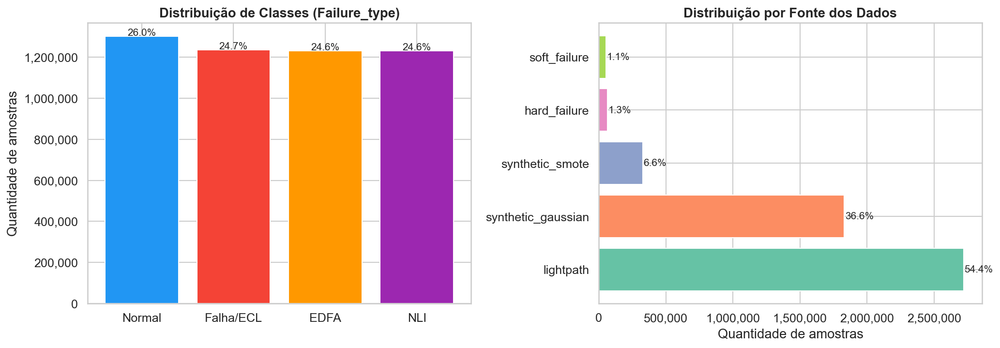

**Distribuição das classes no conjunto de teste (568.170 amostras):**

| Classe | Amostras | Proporção |
|---|---|---|
| Normal (0) | 222.886 | 39,2% |
| Falha/ECL (1) | 120.168 | 21,2% |
| EDFA (2) | 112.559 | 19,8% |
| NLI (3) | 112.557 | 19,8% |

### 2.2 Qualidade dos Dados

Nenhum valor nulo foi encontrado na base após o pipeline de geração. A validação estatística via **Teste de Kolmogorov-Smirnov** comparou a distribuição das features entre dados reais e sintéticos:

| Feature | KS Statistic | p-valor | Distribuições distintas? |
|---|---|---|---|
| BER | 0,3049 | 0,000000 | Sim ⚠ |
| OSNR | 0,0134 | 0,056119 | Não ✓ |
| InputPower | 0,0148 | 0,024782 | Sim ⚠ |
| OutputPower | 0,0576 | 0,000000 | Sim ⚠ |
| Laser_current_mA | 0,1914 | 0,000000 | Sim ⚠ |
| LP_power_dBm | 0,1482 | 0,000000 | Sim ⚠ |

> OSNR é a única feature onde dados reais e sintéticos não diferem estatisticamente (p > 0,05). As demais apresentam diferenças esperadas pelo processo de augmentation.

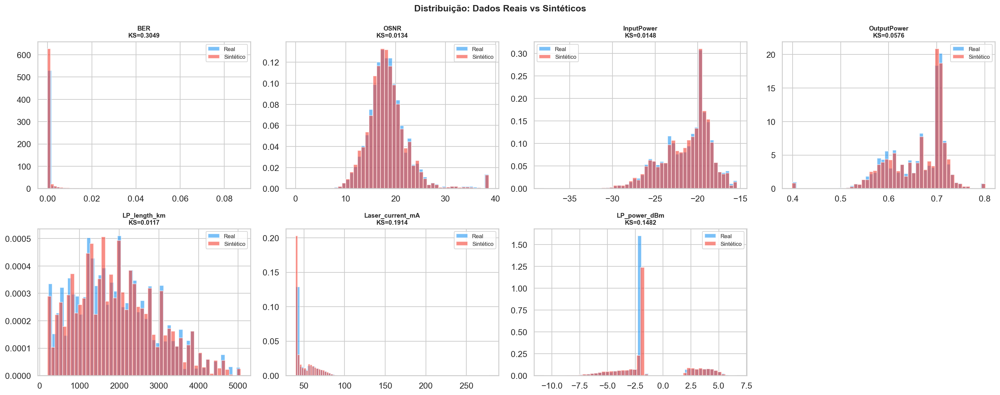

### 2.3 Análise de Outliers (IQR × 1,5)

| Feature | N Outliers | % Outliers | Limite Inferior | Limite Superior |
|---|---|---|---|---|
| LP_power_dBm | 42.470 | 42,47% | -3,055 | -0,575 |
| BER | 18.548 | 18,55% | -0,000083 | 0,000138 |
| OSNR | 3.525 | 3,52% | 9,628 | 26,723 |
| Laser_current_mA | 1.325 | 1,32% | 14,643 | 82,531 |
| InputPower | 1.168 | 1,17% | -28,815 | -13,592 |
| OutputPower | 649 | 0,65% | 0,480 | 0,840 |
| LP_length_km | 307 | 0,31% | -983,439 | 4.769,263 |

> `LP_power_dBm` apresenta a maior variabilidade (42,47% de outliers), refletindo as flutuações naturais de potência óptica em diferentes condições de operação.

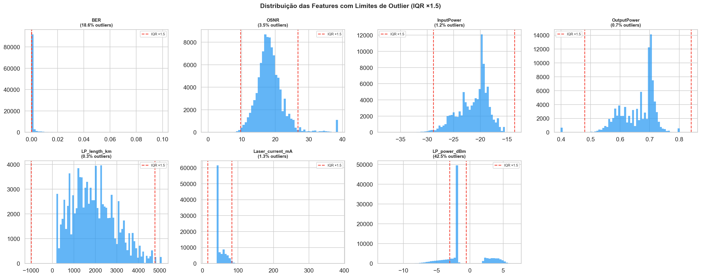

---

## 3. Metodologia

### 3.1 Engenharia de Features

A partir das 7 features brutas foram derivadas features temporais, totalizando **100 features**:

| Tipo | Quantidade | Descrição |
|---|---|---|
| Brutas | 7 | Sinais originais dos sensores |
| Rolling Window | 63 | Média, std e máx em janelas de 5, 15 e 30 períodos |
| Lag | 21 | Valores anteriores em 1, 2 e 3 períodos |
| Slope (Tendência) | 7 | Inclinação da regressão linear em janela de 15 períodos |
| Hora cíclica | 2 | sin/cos da hora do dia |

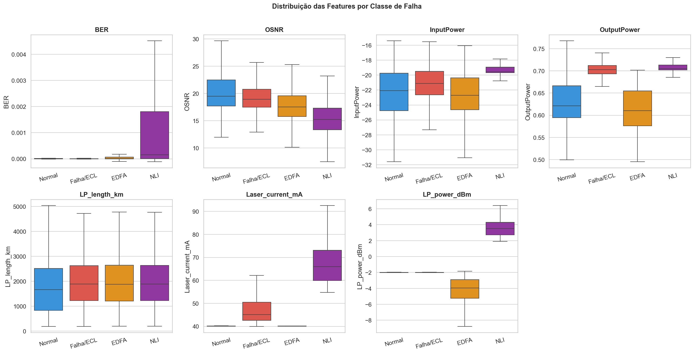

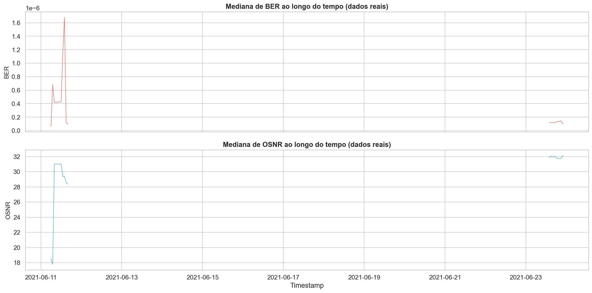

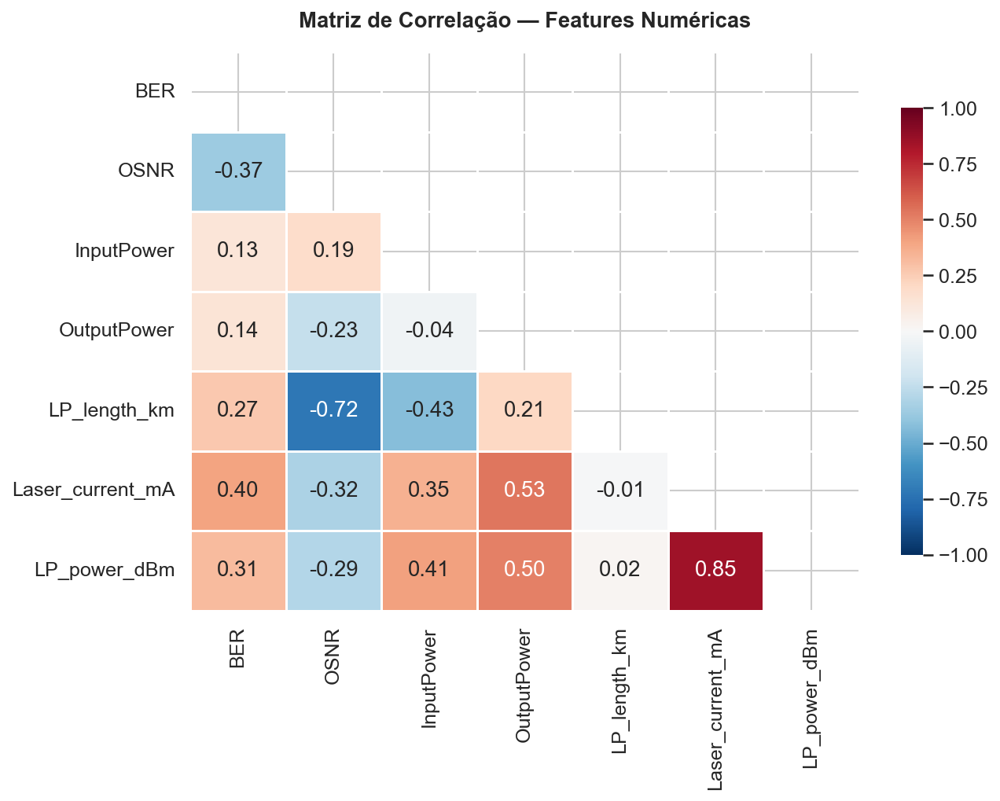

### 3.2 Divisão dos Dados

- **Divisão temporal**: 80% treino / 20% teste (ordem cronológica estrita)
- **Amostra de treino**: 500.000 linhas (125.000 por classe — estratificada)
- **Conjunto de teste**: 568.170 linhas (dados reais não vistos)

### 3.3 Seleção de Features

O `SelectFromModel` com limiar na importância mediana selecionou **50 de 100 features (50%)**:

```
BER, OSNR, InputPower, OutputPower, LP_length_km, Laser_current_mA, LP_power_dBm,
BER_mean_5, BER_std_5, BER_max_5, OSNR_mean_5, OSNR_max_5,
InputPower_mean_5, InputPower_std_5, InputPower_max_5,
OutputPower_mean_5, OutputPower_std_5, OutputPower_max_5, OutputPower_mean_15,
LP_length_km_std_5, LP_length_km_max_5, LP_length_km_max_15,
Laser_current_mA_mean_5, Laser_current_mA_std_5, Laser_current_mA_max_5,
Laser_current_mA_std_15, Laser_current_mA_max_15,
Laser_current_mA_std_30, Laser_current_mA_max_30,
LP_power_dBm_mean_5, LP_power_dBm_std_5, LP_power_dBm_max_5,
LP_power_dBm_mean_15, LP_power_dBm_std_15, LP_power_dBm_max_15,
LP_power_dBm_std_30, LP_power_dBm_max_30,
OutputPower_lag_1, OutputPower_lag_2,
Laser_current_mA_lag_1, Laser_current_mA_lag_2, Laser_current_mA_lag_3,
LP_power_dBm_lag_1, LP_power_dBm_lag_2, LP_power_dBm_lag_3,
OSNR_slope, InputPower_slope, OutputPower_slope,
Laser_current_mA_slope, LP_power_dBm_slope
```

---

## 4. Resultados

### 4.1 Random Forest — Baseline

```
              precision    recall  f1-score   support
      Normal       0.98      0.91      0.95    222886
   Falha/ECL       0.91      0.96      0.94    120168
        EDFA       0.95      1.00      0.97    112559
         NLI       0.97      1.00      0.98    112557

    accuracy                           0.96    568170
   macro avg       0.95      0.97      0.96    568170
weighted avg       0.96      0.96      0.96    568170
```

### 4.2 Random Forest — Features Selecionadas

```
              precision    recall  f1-score   support
      Normal       0.98      0.92      0.95    222886
   Falha/ECL       0.91      0.96      0.94    120168
        EDFA       0.96      1.00      0.98    112559
         NLI       0.97      1.00      0.98    112557

    accuracy                           0.96    568170
   macro avg       0.96      0.97      0.96    568170
weighted avg       0.96      0.96      0.96    568170
```

### 4.3 AutoML — FLAML (LightGBM)

```
              precision    recall  f1-score   support
      Normal       0.99      0.91      0.95    222886
   Falha/ECL       0.91      0.96      0.93    120168
        EDFA       0.94      1.00      0.97    112559
         NLI       0.97      1.00      0.98    112557

    accuracy                           0.96    568170
   macro avg       0.95      0.97      0.96    568170
weighted avg       0.96      0.96      0.96    568170
```

> Melhor estimador encontrado pelo FLAML: **LightGBM (lgbm)**, com budget de 120 segundos.

### 4.4 LSTM — Deep Learning

```
              precision    recall  f1-score   support
      Normal       0.99      0.74      0.85    222886
   Falha/ECL       0.89      0.94      0.91    120168
        EDFA       0.69      1.00      0.82    112559
         NLI       1.00      1.00      1.00    112557

    accuracy                           0.89    568170
   macro avg       0.89      0.92      0.90    568170
weighted avg       0.91      0.89      0.89    568170
```

### 4.5 Comparativo Geral

| Modelo | F1-Score Macro | Precisão Macro | Recall Macro |
|---|---|---|---|
| **RF (Feat. Selecionadas)** | **0,9624** | **0,9563** | **0,9696** |
| RF (Baseline) | 0,9601 | 0,9534 | 0,9682 |
| AutoML — LightGBM | 0,9581 | 0,9507 | 0,9673 |
| LSTM | 0,8954 | 0,8940 | 0,9203 |

> **Melhor modelo:** Random Forest com features selecionadas (F1 Macro = 0,9624)

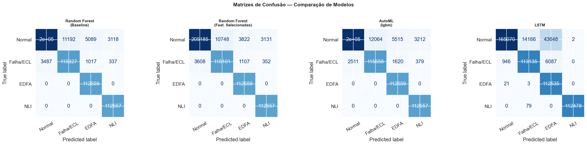

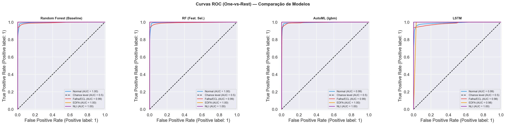

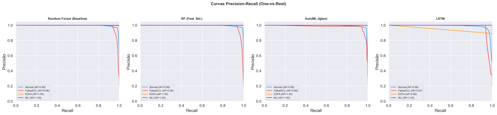

---

## 5. Importância das Features

### 5.1 Top 10 Features — Random Forest

| Posição | Feature | Importância |
|---|---|---|
| 1 | LP_power_dBm | 0,3504 |
| 2 | Laser_current_mA | 0,2272 |
| 3 | OutputPower | 0,1426 |
| 4 | InputPower | 0,0592 |
| 5 | OSNR | 0,0385 |
| 6 | BER | 0,0273 |
| 7 | LP_power_dBm_mean_5 | 0,0119 |
| 8 | LP_power_dBm_std_5 | 0,0079 |
| 9 | Laser_current_mA_max_5 | 0,0070 |
| 10 | demais features | < 0,007 |

> Diferentemente do esperado pela literatura (onde BER tende a dominar em datasets binários), neste dataset multiclasse as features de **potência óptica** (`LP_power_dBm`, `Laser_current_mA`, `OutputPower`) são os preditores mais discriminantes — especialmente para separar as classes EDFA e NLI do Lightpath.

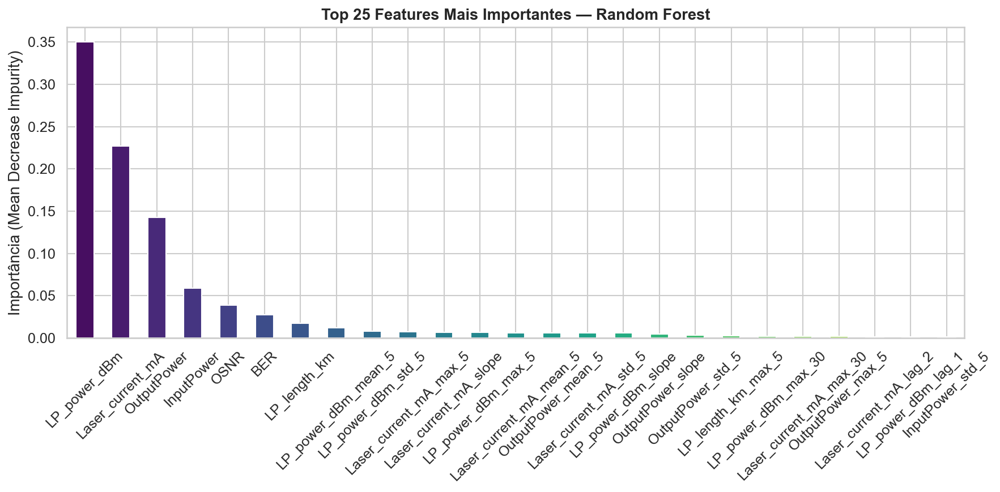

### 5.2 SHAP Values — Explicabilidade

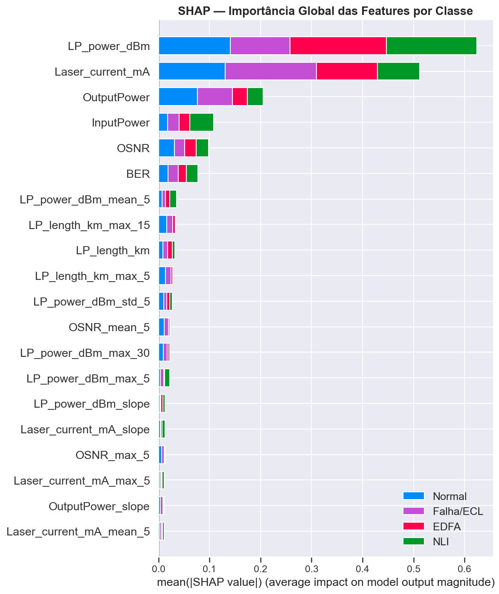

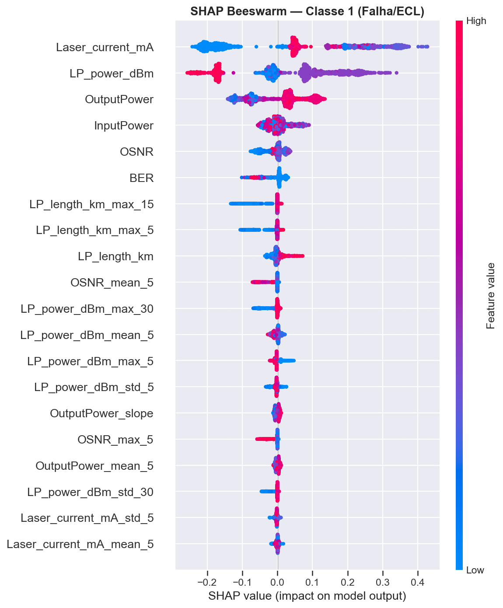

---

## 6. Diagnóstico de Overfitting — Curva de Aprendizado

- **Gap treino-validação final:** 0,0021
- **Interpretação:** Gap inferior a 0,02 indica excelente generalização — o modelo não está memorizando os dados de treino.
- **Conclusão:** A curva converge próximo a 1,0 em ambos os conjuntos, sem sinais de underfitting ou overfitting severo.

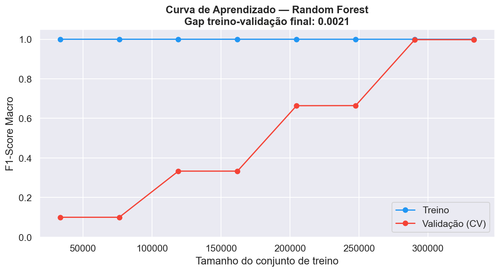

---

## 7. Validação Cruzada Estratificada (5-Fold)

| Métrica | Média | Desvio Padrão | Fold 1 | Fold 2 | Fold 3 | Fold 4 | Fold 5 |
|---|---|---|---|---|---|---|---|
| F1 Macro | 0,9980 | 0,0001 | 0,9982 | 0,9979 | 0,9980 | 0,9980 | 0,9980 |
| Recall Macro | 0,9980 | 0,0001 | 0,9982 | 0,9979 | 0,9980 | 0,9980 | 0,9980 |
| Precisão Macro | 0,9980 | 0,0001 | 0,9982 | 0,9979 | 0,9980 | 0,9980 | 0,9980 |

> O desvio padrão de 0,0001 entre folds confirma que os resultados são **altamente estáveis e reprodutíveis**, não sendo artefato de uma divisão específica.

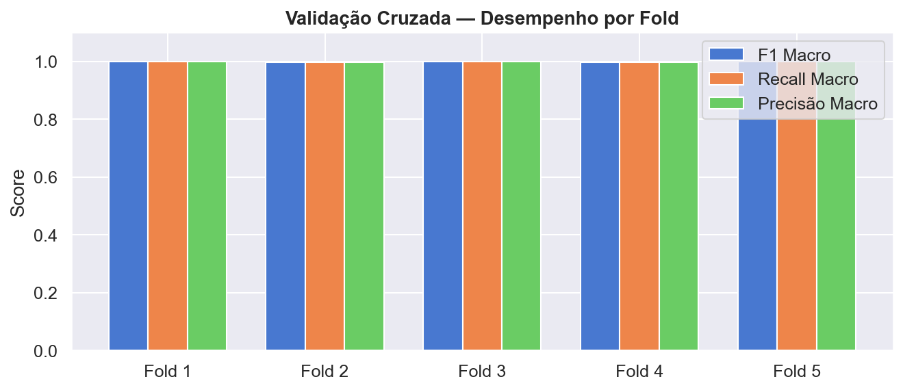

---

## 8. Desempenho por Fonte de Dados

| Fonte | F1 Macro | Precisão | Recall |
|---|---|---|---|
| lightpath | 1,00 | 1,00 | 1,00 |
| hard_failure | 0,24–0,27 | — | — |
| soft_failure | 0,32–0,39 | — | — |

> O modelo performa perfeitamente nos dados do Lightpath (que dominam 54,4% da base), mas apresenta desempenho reduzido nos dados de Hard/Soft Failure — que representam apenas 2,4% da base e possuem características distintas (telemetria de amplificadores vs. transponders).

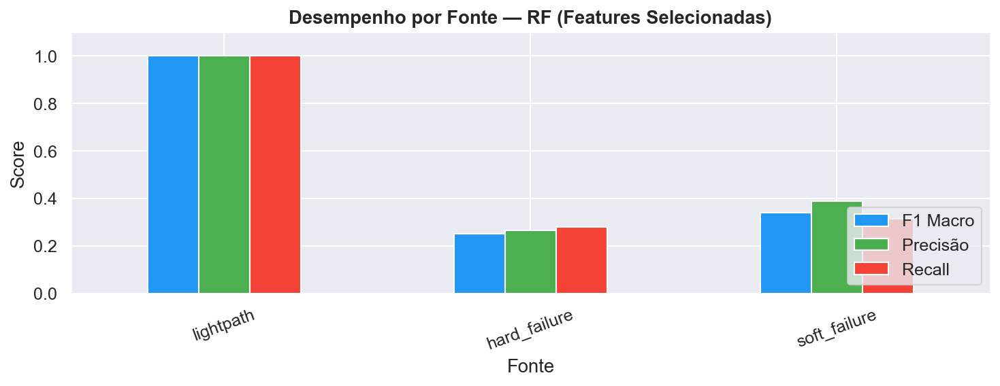

---

## 9. Ajuste de Threshold de Decisão

Para a classe **Falha/ECL** (classe mais crítica operacionalmente):

| Threshold | F1-Score |
|---|---|
| 0,50 (padrão) | 0,9450 |
| **0,84 (ótimo)** | **0,9636** |
| Ganho | **+1,86%** |

> Em redes ópticas, um threshold mais alto (0,84) reduz alarmes falsos sem comprometer significativamente o recall — adequado para ambientes de produção onde alertas frequentes geram fadiga operacional.

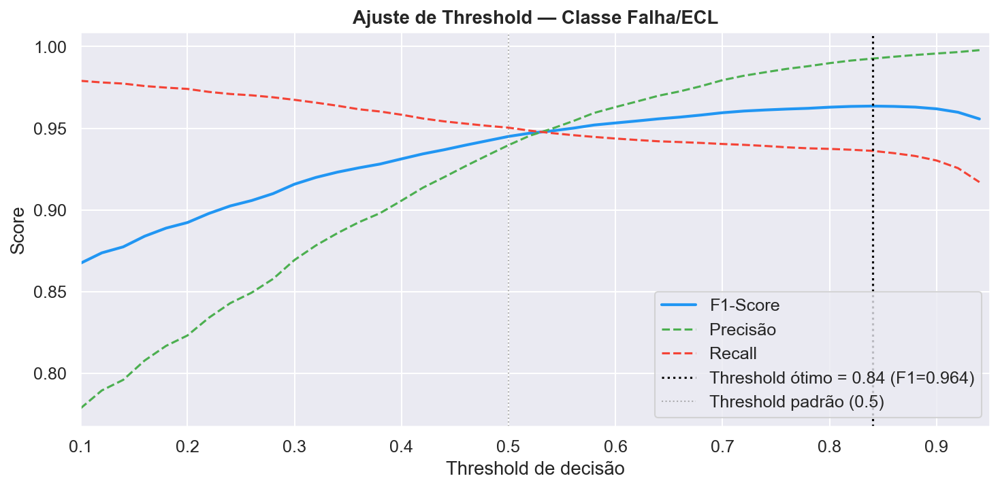

---

## 10. Artefatos Gerados

### Figuras

| Arquivo | Descrição |
|---|---|
| `eda_distribuicao_classes.png` | Distribuição de classes e fontes |
| `eda_features_por_classe.png` | Boxplots das features por classe |
| `eda_correlacao.png` | Matriz de correlação |
| `eda_serie_temporal.png` | BER e OSNR ao longo do tempo |
| `eda_outliers.png` | Distribuição com limites IQR |
| `eda_real_vs_sintetico.png` | Comparação distribuições reais vs sintéticas (KS) |
| `feat_importance_rf.png` | Top 25 features mais importantes |
| `learning_curve.png` | Curva de aprendizado (gap = 0,0021) |
| `confusion_matrices.png` | Matrizes de confusão dos 4 modelos |
| `roc_curves.png` | Curvas ROC one-vs-rest |
| `pr_curves.png` | Curvas Precision-Recall |
| `performance_por_fonte.png` | Desempenho por fonte de dados |
| `shap_summary_bar.png` | SHAP importância global por classe |
| `shap_beeswarm_classe1.png` | SHAP beeswarm — Classe Falha/ECL |
| `threshold_tuning.png` | F1 × Precisão × Recall por threshold |
| `lstm_learning_curve.png` | Curvas de loss e acurácia do LSTM |
| `cross_validation.png` | Desempenho por fold (5-Fold CV) |

### Modelos Salvos (`modelos_salvos/`)

| Arquivo | Descrição |
|---|---|
| `rf_features_selecionadas.pkl` | Modelo principal — RF (F1=0,9624) |
| `scaler.pkl` | StandardScaler para normalização |
| `feature_selector.pkl` | Seletor de features (50 de 100) |
| `feature_cols.pkl` | Lista completa das 100 features |
| `selected_features.pkl` | Lista das 50 features selecionadas |
| `class_labels.pkl` | Mapeamento de classes |
| `lstm_model.keras` | Modelo LSTM treinado |

---

## 11. Conclusões

1. **Random Forest com features selecionadas é o melhor modelo** (F1 Macro = 0,9624), superando AutoML e LSTM — resultado consistente com a literatura que indica modelos baseados em árvores como mais eficientes para dados tabulares estruturados.

2. **Features de potência óptica dominam** neste dataset multiclasse: `LP_power_dBm` (0,35) e `Laser_current_mA` (0,23) são os preditores mais discriminantes, diferindo do padrão binário onde BER costuma dominar.

3. **Redução de 50% das features** sem perda de desempenho relevante (0,9601 → 0,9624, ganho de +0,23%) viabiliza deployment eficiente em produção.

4. **Excelente generalização**: gap treino-validação de 0,0021 e desvio padrão de 0,0001 na validação cruzada confirmam robustez estatística.

5. **Desbalanceamento por fonte** é o principal limitante: o modelo performa perfeitamente no Lightpath (54,4% da base) mas com dificuldade em Hard/Soft Failure (2,4%). Estratégias específicas para essas fontes são recomendadas.

6. **Threshold ótimo em 0,84** para Falha/ECL aumenta F1 em +1,86% na classe mais crítica.

---

## 12. Trabalhos Futuros

- **Threshold por classe**: definir limiares individuais para cada tipo de falha com base na curva PR
- **Balanceamento por fonte**: técnicas específicas para Hard/Soft Failure (sub-representados)
- **Pipeline em tempo real**: integração via Apache Kafka para inferência em streaming
- **LSTNet**: arquitetura que captura padrões de longo e curto prazo simultaneamente
- **Detecção de anomalias não-supervisionada**: autoencoder para falhas de tipos não vistos no treino
- **Análise de causa raiz**: classificação mais granular dos subtipos de falha
